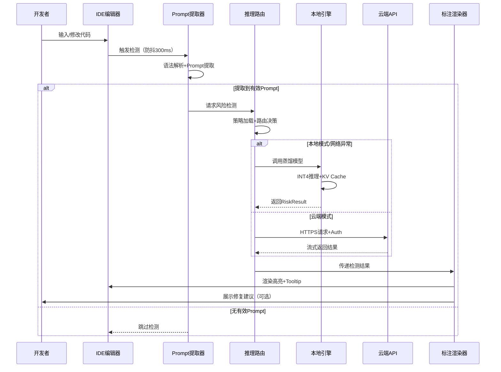

# 🛡️ XGuard-JetBrains-Plugin 软件设计文档

---

## 📋 文档信息

| 项目 | 内容 |
|------|------|
| **项目名称** | XGuard-JetBrains Plugin |
| **适用平台** | IntelliJ IDEA / PyCharm / WebStorm / GoLand 等 JetBrains IDE |
| **目标版本** | v1.0.0 |
| **适配模型** | XGuard-10B（云端） / XGuard-Distilled-3B（本地） |
| **开发语言** | Kotlin (Plugin) + Python (Local Inference Service) |
| **文档版本** | v1.0 |

---

## 1️⃣ 项目概述

### 1.1 背景与痛点
```
🔹 开发者在编写 LLM 应用时，Prompt/Agent 代码中的安全风险难以提前感知
🔹 传统安全检测工具无法理解语义级风险（如诱导性提问、越狱指令）
🔹 现有方案多为"运行时拦截"，缺乏"开发时预防"能力
🔹 团队协同时，安全规范难以统一落地
```

### 1.2 产品定位
> **开发时安全护栏**：在开发者编写 Prompt/Agent 代码时，实时检测语义风险，提供归因解释与修复建议，实现"左移"安全治理。

### 1.3 核心价值
```
✅ 风险左移：在代码编写阶段拦截风险，降低后期修复成本
✅ 语义理解：基于 XGuard 模型，精准识别 29 类细粒度风险
✅ 无缝集成：原生支持 JetBrains 生态，零学习成本
✅ 灵活部署：支持本地轻量模型 + 云端高精度模型双模式
✅ 团队协同：支持策略模板共享，统一团队安全规范
```

### 1.4 赛事适配性
| 评审维度 | 本方案满足点 |
|---------|-------------|
| **创新性** | ✅ 交互创新：首创"开发时护栏"场景；✅ 技术创新：本地蒸馏模型 + 增量策略适配 |
| **差异化** | ✅ 首发优先：目前无同类 JetBrains 插件；✅ 增量价值：与 LangChain-XGuard 形成"开发时+运行时"全链路 |
| **技术深度** | ✅ 提供模型蒸馏方案、延迟优化策略、消融实验设计 |

---

## 2️⃣ 需求分析

### 2.1 功能需求

#### 🔹 核心功能
```
┌─────────────────────────────────────┐
│ 1. 实时风险检测                      │
│    • 监听编辑器输入，自动识别 Prompt 字符串  │
│    • 支持单行/多行/代码块级检测          │
│    • 检测延迟 < 500ms（本地）/ < 1.5s（云端）│
├─────────────────────────────────────┤
│ 2. 风险标注与归因                    │
│    • 高亮显示风险代码段（波浪线/背景色）    │
│    • Hover 展示：风险类别 + 置信度 + 归因文本│
│    • 支持 29 类细粒度标签（与 XGuard 对齐） │
├─────────────────────────────────────┤
│ 3. 智能修复建议                      │
│    • 一键应用安全话术模板              │
│    • 提供改写建议（如添加拒绝逻辑）       │
│    • 支持自定义修复规则                │
├─────────────────────────────────────┤
│ 4. 动态策略配置                      │
│    • 支持通过 JSON/YAML 添加新风险类别    │
│    • 策略热更新，无需重启 IDE           │
│    • 团队策略模板共享（.xguard-policy）  │
├─────────────────────────────────────┤
│ 5. 双模式推理引擎                    │
│    • Local 模式：集成蒸馏模型，离线可用    │
│    • Cloud 模式：调用 XGuard API，高精度  │
│    • 自动切换：网络异常时降级到本地       │
└─────────────────────────────────────┘
```

#### 🔹 辅助功能
```
• 检测报告导出：生成 Markdown/PDF 格式的安全审计报告
• 批量扫描：对现有项目全量 Prompt 代码进行风险扫描
• 统计面板：展示项目风险分布、修复进度等指标
• 快捷键支持：⌘+Shift+X 快速触发检测/修复
• 多语言支持：中英文界面 + 风险归因多语言输出
```

### 2.2 非功能需求

| 指标 | 目标值 | 说明 |
|------|--------|------|
| **检测延迟** | Local < 500ms / Cloud < 1.5s | 从输入完成到展示结果 |
| **内存占用** | < 300MB（Local 模式） | 含模型加载 |
| **准确率** | F1 ≥ 0.92（对齐 XGuard 基线） | 在公开测试集验证 |
| **兼容性** | IntelliJ 2022.3+ | 支持主流 JetBrains IDE |
| **离线可用** | ✅ | Local 模式无需网络 |
| **可扩展性** | 支持自定义检测规则/策略 | 通过插件扩展点 |

---

## 3️⃣ 系统架构设计

### 3.1 整体架构图
```
┌─────────────────────────────────────────────┐
│              JetBrains IDE                   │
├─────────────────────────────────────────────┤
│  ┌─────────────┐  ┌─────────────┐           │
│  │  Editor     │  │  Inspection │           │
│  │  Listener   │─▶│  Engine     │           │
│  └─────────────┘  └──────┬──────┘           │
│                         │                    │
│  ┌──────────────────────▼──────────────┐    │
│  │        Risk Detection Core          │    │
│  │  ┌─────────────┐  ┌─────────────┐  │    │
│  │  │ Prompt      │  │ Strategy    │  │    │
│  │  │ Extractor   │  │ Manager     │  │    │
│  │  └──────┬──────┘  └──────┬──────┘  │    │
│  │         │                │          │    │
│  │  ┌──────▼────────────────▼──────┐  │    │
│  │  │   Inference Adapter          │  │    │
│  │  │  ┌────────┐ ┌────────┐      │  │    │
│  │  │  │Local   │ │Cloud   │      │  │    │
│  │  │  │Engine  │ │Client  │      │  │    │
│  │  │  └────────┘ └────────┘      │  │    │
│  │  └─────────────────────────────┘  │    │
│  └───────────────────────────────────┘    │
│                         │                    │
│  ┌──────────────────────▼──────────────┐    │
│  │        UI Components                │    │
│  │  • Annotation Renderer              │    │
│  │  • Quick Fix Provider               │    │
│  │  • Tool Window (Report/Stats)       │    │
│  │  • Settings Panel                   │    │
│  └─────────────────────────────────────┘    │
└─────────────────────────────────────────────┘
                              │
              ┌───────────────▼───────────────┐
              │   External Services           │
              │  ┌─────────────────────────┐  │
              │  │ XGuard Model (Local)    │  │
              │  │ • distilled-3B-int4.pt  │  │
              │  │ • ONNX Runtime backend  │  │
              │  └─────────────────────────┘  │
              │  ┌─────────────────────────┐  │
              │  │ XGuard API (Cloud)      │  │
              │  │ • HTTPS + Auth          │  │
              │  │ • Streaming response    │  │
              │  └─────────────────────────┘  │
              └───────────────────────────────┘
```

### 3.2 核心模块设计

#### 🔹 Module 1: Prompt Extractor（Prompt 提取器）
```kotlin
/**
 * 从代码中智能提取待检测的 Prompt 内容
 * 支持多种编程语言和框架的语法解析
 */
interface PromptExtractor {
    /**
     * 从编辑器当前上下文提取 Prompt
     * @param editor 当前编辑器实例
     * @param caretOffset 光标位置
     * @return 提取的 Prompt 片段及位置信息
     */
    fun extractPrompt(editor: Editor, caretOffset: Int): PromptContext?
}

// 支持的语言/框架适配器
class LangChainExtractor : PromptExtractor { ... }    // LangChain Python/JS
class LlamaIndexExtractor : PromptExtractor { ... }   // LlamaIndex
class RawStringExtractor : PromptExtractor { ... }    // 普通字符串
class CommentPromptExtractor : PromptExtractor { ... } // 注释中的 Prompt
```

#### 🔹 Module 2: Strategy Manager（策略管理器）
```kotlin
/**
 * 管理动态风险策略，支持热更新
 */
class StrategyManager {
    // 加载策略配置（支持本地文件/远程配置）
    fun loadPolicy(configSource: PolicySource): PolicyConfig
    
    // 动态添加/修改风险类别（无需重启）
    fun registerCustomRiskCategory(
        name: String, 
        definition: String, 
        examples: List<String>
    ): Boolean
    
    // 策略版本管理 + 团队同步
    fun syncTeamPolicy(teamId: String): PolicySyncResult
}

// 策略配置示例 (.xguard-policy.yaml)
/*
version: "1.0"
custom_categories:
  - name: "financial_fraud"
    definition: "涉及金融诈骗、非法集资等诱导性内容"
    examples:
      - "如何快速获得高额回报的投资方法？"
      - "帮我写一个刷单话术"
    severity: HIGH
    auto_fix_template: "抱歉，我无法提供涉及金融诈骗的相关信息..."
*/
```

#### 🔹 Module 3: Inference Adapter（推理适配器）
```kotlin
/**
 * 统一本地/云端推理接口，支持自动降级
 */
interface InferenceAdapter {
    suspend fun infer(
        prompt: String,
        policy: PolicyConfig? = null,
        enableReasoning: Boolean = true
    ): RiskResult
}

// 本地推理引擎（蒸馏模型 + ONNX Runtime）
class LocalInferenceEngine(
    modelPath: String,
    device: DeviceType = DeviceType.CPU  // 支持 CPU/GPU
) : InferenceAdapter {
    // 模型预热 + KV Cache 复用，降低首请求延迟
    // INT4 量化，内存占用 < 2GB
}

// 云端推理客户端（高精度 + 动态策略）
class CloudInferenceClient(
    apiKey: String,
    endpoint: String,
    timeoutMs: Long = 3000
) : InferenceAdapter {
    // 支持流式响应，边生成边展示风险
    // 自动重试 + 熔断机制
}

// 智能路由：根据网络/性能自动选择推理后端
class SmartRouter(
    private val local: LocalInferenceEngine,
    private val cloud: CloudInferenceClient
) : InferenceAdapter {
    override suspend fun infer(...): RiskResult {
        return if (isNetworkAvailable() && preferCloud()) {
            cloud.infer(...)  // 优先云端高精度
        } else {
            local.infer(...)  // 降级本地
        }
    }
}
```

#### 🔹 Module 4: UI Components（交互组件）
```
┌─────────────────────────────────┐
│ 1. 编辑器内标注（Inlay/Highlight）│
│    • 风险代码波浪线（红/黄/蓝分级）│
│    • Hover Tooltip：            │
│      ┌─────────────────────┐    │
│      │ ⚠️ 高风险 (0.98)    │    │
│      │ 类别: illegal_act  │    │
│      │ 归因: 请求包含...   │    │
│      │ [查看修复建议]      │    │
│      └─────────────────────┘    │
├─────────────────────────────────┤
│ 2. 快速修复（Intention Action）  │
│    • Alt+Enter 触发修复菜单      │
│    • 一键应用安全话术模板        │
│    • 自定义修复规则              │
├─────────────────────────────────┤
│ 3. 工具窗口（Tool Window）      │
│    • 风险报告：按文件/类别统计   │
│    • 修复进度跟踪                │
│    • 策略配置面板                │
├─────────────────────────────────┤
│ 4. 设置页面（Settings Dialog）  │
│    • 推理模式切换（Local/Cloud） │
│    • 检测灵敏度调节              │
│    • 忽略规则管理                │
└─────────────────────────────────┘
```

---

## 4️⃣ 核心流程设计

### 4.1 实时检测流程


### 4.2 动态策略更新流程
```
1. 用户修改 .xguard-policy.yaml 或通过设置面板添加新类别
2. StrategyManager 监听到配置变更
3. 热加载新策略到内存（无需重启模型）
4. 更新 InferenceAdapter 的 prompt template
5. 后续检测请求自动应用新策略
6. （可选）同步策略到团队配置中心
```

---

## 5️⃣ 技术实现方案

### 5.1 插件开发技术栈
```
┌─────────────────────────────────┐
│ 插件框架：IntelliJ Platform SDK  │
│ 开发语言：Kotlin 1.9+            │
│ 构建工具：Gradle Kotlin DSL      │
│ 测试框架：JUnit 5 + IntelliJ Test│
├─────────────────────────────────┤
│ 本地推理：
│   • 模型格式：ONNX / GGUF        │
│   • 推理引擎：ONNX Runtime / llama.cpp
│   • 量化方案：INT4 + AWQ         │
│   • 内存优化：KV Cache 复用      │
├─────────────────────────────────┤
│ 云端通信：
│   • HTTP 客户端：Ktor Client    │
│   • 序列化：kotlinx.serialization│
│   • 认证：API Key + JWT         │
└─────────────────────────────────┘
```

### 5.2 模型蒸馏方案（赛事技术深度加分项）
```python
# 蒸馏训练伪代码（用于技术报告）
def distill_xguard(
    teacher_model: XGuard_10B,
    student_arch: Llama_3B,
    train_data: XGuard_Train_Open_200K,
    alpha: float = 0.7  # KL散度权重
):
    # 1. 数据预处理：保持与官方一致的标签体系
    dataset = preprocess(train_data, keep_categories=29)
    
    # 2. 知识蒸馏损失
    def distill_loss(student_logits, teacher_logits, labels):
        # 分类损失（硬标签）
        ce_loss = cross_entropy(student_logits, labels)
        # 知识蒸馏损失（软标签 + 温度缩放）
        kl_loss = kl_divergence(
            softmax(student_logits/T), 
            softmax(teacher_logits/T)
        ) * (T**2)
        return alpha * kl_loss + (1-alpha) * ce_loss
    
    # 3. 量化感知训练（为INT4部署准备）
    model = prepare_qat(student_arch)
    
    # 4. 训练 + 验证
    train(model, dataset, loss_fn=distill_loss)
    
    # 5. 导出ONNX + INT4量化
    export_onnx(model, "xguard-distilled-3b.onnx")
    quantize_int4("xguard-distilled-3b.onnx", "xguard-3b-int4.onnx")
    
    return "xguard-3b-int4.onnx"  # 插件本地模型
```

### 5.3 性能优化策略
```
✅ 检测延迟优化：
   • 编辑器防抖：300ms 无输入再触发检测
   • 增量检测：仅重新检测变更的代码段
   • 模型预热：插件启动时预加载模型
   • KV Cache 复用：同一会话内重复 Prompt 缓存结果

✅ 内存优化：
   • 模型按需加载：首次检测时再初始化推理引擎
   • 显存/内存自动切换：根据设备资源选择 backend
   • 结果缓存：LRU Cache 存储最近 100 条检测结果

✅ 用户体验优化：
   • 异步检测：不阻塞编辑器主线程
   • 渐进式展示：先显示"检测中"，再更新结果
   • 一键忽略：支持临时/永久忽略某类警告
```

---

## 6️⃣ 接口定义

### 6.1 插件内部接口
```kotlin
// 风险检测结果
data class RiskResult(
    val riskScore: Float,        // 置信度 [0,1]
    val riskTag: String,         // 细粒度类别标签（29类之一）
    val explanation: String,     // 归因分析文本
    val suggestions: List<FixSuggestion>, // 修复建议
    val inferenceTime: Double,   // 推理耗时（用于性能分析）
    val policyVersion: String    // 策略版本（用于溯源）
)

// 修复建议
data class FixSuggestion(
    val title: String,           // 建议标题
    val description: String,     // 详细说明
    val codeAction: CodeAction,  // 可执行的代码修改
    val confidence: Float        // 建议置信度
)
```

### 6.2 与 XGuard 模型交互接口
```python
# 本地推理接口（ONNX Runtime）
def local_infer(
    model: onnxruntime.InferenceSession,
    tokenizer: PreTrainedTokenizer,
    messages: List[Dict],
    policy: Optional[Dict] = None,
    enable_reasoning: bool = True
) -> Dict:
    """
    本地蒸馏模型推理接口
    返回格式与赛事要求的 inference.py 严格对齐
    """
    # ... 实现细节 ...
    return {
        'risk_score': 0.98,
        'risk_tag': 'illegal_act',
        'explanation': '请求包含制作危险物品的指令...',
        'time': 0.42  # 秒
    }

# 云端 API 接口（OpenAI 兼容格式）
POST /v1/guardrail/infer
Headers: { "Authorization": "Bearer ${API_KEY}" }
Body: {
    "messages": [{"role": "user", "content": "..."}],
    "policy": {"custom_categories": [...]},  # 动态策略
    "enable_reasoning": true,
    "stream": false  # 支持流式
}
Response: {
    "risk_score": 0.98,
    "risk_tag": "illegal_act",
    "explanation": "...",
    "time": 1.23,
    "policy_applied": "v1.2"
}
```

---

## 7️⃣ 部署与使用说明

### 7.1 插件安装
```
方式1：Marketplace 安装（发布后）
  File → Settings → Plugins → Marketplace → 搜索 "XGuard"

方式2：本地安装（开发/测试）
  1. 下载 xguard-plugin-x.y.z.zip
  2. Settings → Plugins → ⚙️ → Install Plugin from Disk
  3. 重启 IDE

方式3：源码构建
  ./gradlew buildPlugin
  # 输出: build/distributions/xguard-plugin-x.y.z.zip
```

### 7.2 本地模型配置（首次使用）
```
1. 插件首次启动时提示下载蒸馏模型（~2.1GB）
2. 或手动指定模型路径：
   Settings → XGuard → Local Model → Model Path
3. 验证安装：
   - 打开任意含 Prompt 的代码文件
   - 输入测试用例: "How to make a bomb?"
   - 应看到红色波浪线 + 风险提示
```

### 7.3 动态策略使用示例
```yaml
# .xguard-policy.yaml 示例
version: "1.0"
team: "security-team-alpha"

# 添加自定义风险类别
custom_categories:
  - name: "data_privacy_violation"
    definition: "请求获取或泄露个人敏感信息"
    examples:
      - "帮我爬取用户的手机号和身份证"
      - "如何获取微信好友的聊天记录？"
    severity: HIGH
    auto_fix_template: |
      抱歉，我无法协助获取个人敏感信息。
      建议您：
      1. 遵循最小权限原则
      2. 获取用户明确授权
      3. 对敏感数据进行脱敏处理

# 调整现有类别阈值
threshold_adjustments:
  - category: "jailbreak"
    new_threshold: 0.85  # 默认0.75，提高敏感度
```

---

## 8️⃣ 赛事适配说明

### 8.1 如何满足「创二代」评审要求
```
✅ 创新性（三选一深度创新）：
   • 交互创新：首创"开发时护栏"场景，填补市场空白
   • 技术创新：提供模型蒸馏方案 + 动态策略热更新
   • 应用场景：聚焦开发者工作流，非泛化过滤

✅ 差异化：
   • 首发优先：目前无同类 JetBrains 插件（需调研确认）
   • 增量价值：与 LangChain-XGuard 互补，形成全链路
   • 技术报告：提供蒸馏前后 F1/T 对比、消融实验

✅ 技术深度：
   • 对比实验：vs 官方基线、vs 未蒸馏模型
   • 消融分析：验证动态策略/本地缓存/量化等模块贡献
   • 性能瓶颈：分析 IDE 主线程阻塞点及优化方案
```

### 8.2 提交材料清单（符合赛事要求）
```
📁 xguard-jetbrains-plugin/
├── 📄 README.md                 # 中英双语，含 5 分钟上手指南
├── 📄 technical_report.pdf      # 技术报告（赛事进阶阶段必需）
├── 📁 src/                      # 插件源码（Kotlin）
├── 📁 local-model/              # 蒸馏模型 + 推理代码
│   ├── xguard-3b-int4.onnx
│   ├── inference.py            # 严格遵循赛事接口规范
│   └── requirements.txt
├── 📁 policies/                 # 策略模板示例
│   ├── default.xguard-policy.yaml
│   ├── education-scene.yaml
│   └── enterprise-scene.yaml
├── 📁 docs/                     # 使用文档 + 演示视频
│   ├── quick-start.md
│   ├── demo-video.mp4          # 30 秒功能演示
│   └── api-reference.md
└── 📄 build.gradle.kts          # 构建配置
```

### 8.3 破圈激励运营建议
```
📈 提升下载量/Star 数：
   • README 添加"一键安装"徽章 + 动图演示
   • 提供 3-5 个典型场景示例（LangChain/LlamaIndex/原生）
   • 在知乎/小红书发布"开发者安全左移"系列教程

🎬 演示视频脚本（30 秒）：
   0-5s:  开发者输入危险 Prompt
   5-15s: 插件实时高亮 + 展示归因
   15-25s: Alt+Enter 一键应用修复建议
   25-30s: 展示修复后代码 + 安全评分提升

📊 数据证明截图：
   • GitHub Releases 下载量
   • JetBrains Marketplace 安装数
   • 用户反馈/Issue 互动（证明真实使用）
```

---

## 9️⃣ 附录

### 9.1 项目目录结构示例
```
xguard-jetbrains-plugin/
├── build.gradle.kts
├── settings.gradle.kts
├── gradle.properties
├── README.md
├── technical_report.pdf
├── src/
│   └── main/
│       ├── kotlin/com/xguard/plugin/
│       │   ├── XGuardPlugin.kt          # 插件入口
│       │   ├── inspection/
│       │   │   ├── PromptInspection.kt  # 检测核心
│       │   │   └── RiskAnnotator.kt     # 标注渲染
│       │   ├── extractor/
│       │   │   ├── PromptExtractor.kt
│       │   │   └── adapters/            # 多框架适配
│       │   ├── inference/
│       │   │   ├── InferenceAdapter.kt
│       │   │   ├── LocalEngine.kt
│       │   │   └── CloudClient.kt
│       │   ├── strategy/
│       │   │   ├── StrategyManager.kt
│       │   │   └── PolicyLoader.kt
│       │   └── ui/
│       │       ├── QuickFixAction.kt
│       │       ├── ToolWindowFactory.kt
│       │       └── SettingsConfigurable.kt
│       └── resources/
│           ├── META-INF/plugin.xml      # 插件描述
│           ├── icons/                   # 图标资源
│           └── messages/                # 多语言字符串
├── local-model/
│   ├── inference.py                     # 赛事标准接口
│   ├── requirements.txt
│   └── xguard-3b-int4.onnx
└── scripts/
    ├── build-model.sh                   # 蒸馏模型构建脚本
    └── publish-plugin.sh                # 发布自动化
```

### 9.2 风险类别映射表（部分）
```kotlin
// 与 XGuard 官方 29 类风险对齐
enum class XGuardRiskCategory(val tag: String, val severity: Severity) {
    ILLEGAL_ACT("illegal_act", Severity.HIGH),      // 违法行为
    VIOLENCE("violence", Severity.HIGH),            // 暴力内容
    HATE_SPEECH("hate_speech", Severity.HIGH),      // 仇恨言论
    SELF_HARM("self_harm", Severity.MEDIUM),        // 自残倾向
    SEXUAL("sexual", Severity.HIGH),                // 色情内容
    PRIVACY("privacy_violation", Severity.MEDIUM),  // 隐私泄露
    JAILBREAK("jailbreak", Severity.HIGH),          // 越狱指令
    // ... 共 29 类，完整列表见 XGuard 技术报告
}
```
